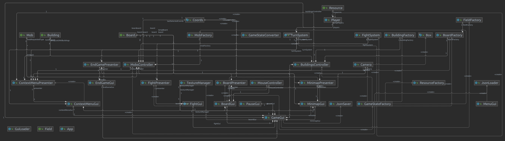

# The Engineer

Project implemented as part of the Software Engineering Course in the academic year 2021/22.
The goal was to create a simple turn-based strategy game, using test-driven development and Model-View-Presenter concepts

# UML diagram

